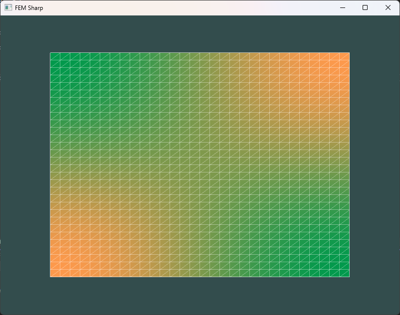

# FEM Sharp

Finite Element Method using C#/.NET and visualization with OpenGL.

Currently, it is only able to solve a simple Helmholtz equation with a source:

$$\begin{align} 
-\nabla^2 u + k\cdot u &= f\\ 
\nabla u \cdot\mathbf{\dot{n}}&=0\mbox{ on  } \Gamma
\end{align}$$

Using the method of manufactured solutions, we pick the for the analytic solution
 
$$u(x,y)=\cos\left(\frac{\pi(x-L_1)}{L_2-L_1}\right)\cos\left(\frac{\pi(y-H_1)}{H_2-H_1}\right),$$

resulting in a force 

$$f(x,y)=\left(k+\left(\frac{\pi}{L_2-L_1}\right)^2+\left(\frac{\pi}{H_2-H_1}\right)^2\right)u(x,y).$$

Using $k=5$, this produces in the following image:

