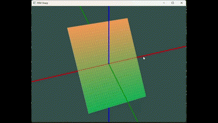

# FEM Sharp

Finite Element Method using C#/.NET and visualization with OpenGL.

Currently, it is only able to solve the Helmholtz equation with a source and Laplace's equation with boundary conditions. For the simulations, a 2-dimensional rectangular grid is used, were $\Omega=[x_1, x_2]\times[y_1, y_2]$. The implemented FEM problems are then defined as

$$\begin{align} 
-\nabla^2 u + k\cdot u &= f\\ 
\nabla u \cdot\mathbf{\dot{n}}&=0\mbox{ on  } \partial\Omega,
\end{align}$$

and 

$$\begin{align} 
-\nabla^2 u &= f,\\ 
\frac{\partial u}{\partial n}(x,y_1) = \frac{\partial u}{\partial n}(x,y_2)=0,\\
u(x_1, y) = u(x_2, y) =0.
\end{align}$$

This produces the following simulation:

